## OpenAQ Data Pipeline (ELT)

A modern, containerized, and scalable data pipeline designed to ingest, store, and transform real-time air quality data from the OpenAQ API.


## Architecture

This project follows a decoupled **ELT (Extract, Load, Transform)** architecture pattern:

```mermaid
graph LR
    %% --- EXTERNAL SOURCES ---
    source1[OpenAQ API]
    source2[Google Sheets]
    bi[Looker Studio]

    %% --- GLOBAL ORCHESTRATION (AIRFLOW) ---
    subgraph "Apache Airflow"
        direction LR
        
        %% Ingestion (Outside the DW)
        ingest(Google Cloud Storage / Data Lake)
        
        %% --- DATA WAREHOUSE (dbt) ---
        subgraph "BigQuery (dbt)"
            direction TB
            
            %% Bronze Layer (Source)
            raw("Bronze Layer (Raw Ingestion)")
            
            %% Silver Layer (Transformation)
            staging("Silver Layer (Staging / Clean)")
            
            %% Gold Layer (Serving)
            marts("Gold Layer (Marts / Business)")
        end
    end

    %% --- RELATIONS ---
    source1 -->|Python Extraction| ingest
    source2 -->|Config Data| ingest
    
    ingest -->|Load NDJSON| raw
    raw -->|dbt source & test| staging
    staging -->|dbt model & test| marts
    marts -->|Connect| bi

    %% --- STYLES ---
    classDef external fill:#f3e5f5,stroke:#7b1fa2,stroke-width:2px;
    classDef storage fill:#e1f5fe,stroke:#01579b,stroke-width:2px;
    
    %% Medallion colors
    classDef bronze fill:#d7ccc8,stroke:#5d4037,stroke-width:2px; 
    classDef silver fill:#e0e0e0,stroke:#616161,stroke-width:2px;
    classDef gold fill:#fff9c4,stroke:#fbc02d,stroke-width:3px;

    %% Classes
    class source1,source2,bi external;
    class ingest storage;
    class raw bronze;
    class staging silver;
    class marts gold;
```



## Key Features (Engineering Highlights)

Idempotency & Replayability: The pipeline is fully idempotent. It uses logical partitioning (logical_date) and deduplication strategies to ensure safe backfills and historical re-runs without data duplication.

Schema Evolution Handling: Leverages BigQuery's JSON data type for raw ingestion, allowing the pipeline to be resilient to upstream API schema changes (schema drift) without breaking the ingestion layer.

Robust Partitioning Strategy: Implements a composite strategy: Partitioning by Logical Date (for efficient backfills and cost management) + Clustering by Ingestion Timestamp (for fast "latest state" retrieval).

Data Quality (DataOps): Integrated dbt tests (schema, referential integrity, and custom business logic) ensure that only high-quality data reaches the production marts.

Infrastructure as Code: Local development environment is fully containerized using Docker Compose, mirroring production services.

## Tech Stack

Orchestration: Apache Airflow (running on Docker).

Ingestion: Python (Requests, Pandas, Google Cloud SDK).

Data Lake: Google Cloud Storage (NDJSON format, hive-partitioned).

Data Warehouse: Google BigQuery.

Transformation: dbt (data build tool) Core.

Version Control: Git & GitHub.

## Project Structure

```Bash
.
├── dags/                   # Airflow DAGs (Ingestion & Transformation triggers)
├── scripts/                # Python Extraction Logic (Pure ETL scripts)
├── openaq_transform/       # dbt Project (SQL Models, Tests, Seeds)
├── docker-compose.yaml     # Local Infrastructure Definition
└── README.md               # Documentation
```

## Quick Start

Clone the repository:

```Bash
git clone [https://github.com/pacomoraless2/openaq-data-pipeline.git](https://github.com/pacomoraless2/openaq-data-pipeline.git)
cd openaq-data-pipeline
```

Configure Credentials:

Place your GCP Service Account key at config/google_credentials.json.

Set up environment variables in .env.

Launch Infrastructure:

```Bash
docker-compose up -d
```

Access Airflow UI:

URL: <http://localhost:8080>

Credentials: airflow / airflow

Developed by Paco Morales
