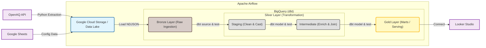

# OpenAQ Data Pipeline: Global Air Quality ELT 

A modern, containerized, and scalable data pipeline designed to ingest, store, and transform real-time air quality data from the OpenAQ API into an analytics-ready Data Warehouse.


##  Project Overview
This project extracts raw meteorological and pollutant data from global monitoring stations, securely stages it in a Data Lake, and applies rigorous dimensional modeling and quality testing to serve business-critical datasets. It is built with a focus on **idempotency, FinOps, and strict data quality constraints**.

##  Architecture (Medallion Pattern)

This pipeline implements a decoupled **ELT (Extract, Load, Transform)** architecture following the Medallion Data Design principles.


```mermaid
graph LR
    %% --- EXTERNAL SOURCES ---
    source1[OpenAQ API]
    source2[Google Sheets]
    bi[Looker Studio]

    %% --- GLOBAL ORCHESTRATION (AIRFLOW) ---
    subgraph "Apache Airflow"
        direction LR
        
        %% Ingestion (Outside the DW)
        ingest(Google Cloud Storage / Data Lake)
        
        %% --- DATA WAREHOUSE (dbt) ---
        subgraph "BigQuery (dbt)"
            direction TB
            
            %% Bronze Layer
            raw("Bronze Layer (Raw Ingestion)")
            
            %% Silver Layer (Split into Staging and Intermediate)
            subgraph "Silver Layer (Transformation)"
                direction LR
                staging("Staging (Clean & Cast)")
                inter("Intermediate (Enrich & Join)")
            end
            
            %% Gold Layer
            marts("Gold Layer (Marts / Serving)")
        end
    end

    %% --- RELATIONS ---
    source1 -->|Python Extraction| ingest
    source2 -->|Config Data| ingest
    
    ingest -->|Load NDJSON| raw
    raw -->|dbt source & test| staging
    staging -->|dbt model & test| inter
    inter -->|dbt model & test| marts
    marts -->|Connect| bi

    %% --- STYLES ---
    classDef external fill:#f3e5f5,stroke:#7b1fa2,stroke-width:2px;
    classDef storage fill:#e1f5fe,stroke:#01579b,stroke-width:2px;
    
    %% Medallion colors
    classDef bronze fill:#d7ccc8,stroke:#5d4037,stroke-width:2px; 
    classDef silver fill:#e0e0e0,stroke:#616161,stroke-width:2px;
    classDef gold fill:#fff9c4,stroke:#fbc02d,stroke-width:3px;

    %% Classes
    class source1,source2,bi external;
    class ingest storage;
    class raw bronze;
    class staging,inter silver;
    class marts gold;
```

##  Engineering Highlights

-   **Data-Aware Orchestration:** Replaced rigid time-based triggers with Airflow Datasets (`schedule=[bronze_ready_dataset]`). The dbt transformation DAG automatically executes only when upstream data extraction is confirmed, decoupling dependencies.
    
-   **Dimensional Modeling (Star Schema):** Transformed raw API JSONs into a robust Star Schema consisting of a Conformed Dimension (`dim_locations`) and ultra-fast Fact tables (`mart_location_air_quality`, `mart_location_weather`).
    
-   **Advanced Data Quality (DataOps):** Implemented custom generic Jinja macros in dbt to enforce physical laws on data (e.g., rejecting negative atmospheric particle concentrations or out-of-bounds thermodynamic temperatures) ensuring high-fidelity analytics.
    
-   **Idempotency & Surrogate Keys:** The pipeline is fully replayable. It utilizes deterministic MD5 hashing for Surrogate Keys and logical date partitioning to guarantee safe backfills without data duplication.
    
-   **FinOps & BigQuery Optimization:** Designed with a composite physical layout combining partitioning by logical date (for cost-effective backfills) and clustering by geographical attributes to minimize bytes processed during BI queries.
    
-   **Schema Evolution Resilience:** Leverages BigQuery's native `JSON` data type for the Bronze layer ingestion, creating a defense against upstream API schema drift without breaking the ingestion DAGs.
    

##  Tech Stack

-   **Orchestration:** Apache Airflow 2.9 (Dockerized).
    
-   **Ingestion:** Python (Requests, Pandas, Google Cloud SDK).
    
-   **Data Lake:** Google Cloud Storage (Hive-partitioned NDJSON).
    
-   **Data Warehouse:** Google BigQuery.
    
-   **Transformation:** dbt core.
    
-   **Version Control:** Git & GitHub.
    

##  Project Structure


```
.
├── dags/                   # Airflow DAGs (Data-Aware scheduling)
├── scripts/                # Python Extraction Logic (Pure ETL components)
├── openaq_transform/       # dbt Project (Models, Custom Macros, Tests, Catalog)
├── docker-compose.yaml     # Local Infrastructure Definition
└── README.md               # Documentation

```

##  Quick Start

**1. Clone the repository:**


```
git clone [https://github.com/pacomoraless2/openaq-data-pipeline.git](https://github.com/pacomoraless2/openaq-data-pipeline.git)
cd openaq-data-pipeline

```

**2. Configure Credentials:**

-   Place your GCP Service Account JSON key at `config/google_credentials.json`.
    
-   Set up your required environment variables in the `.env` file (see `.env.example`).
    

**3. Launch Infrastructure:**


```
docker-compose up -d

```

**4. Access Airflow UI:**

-   **URL:** http://localhost:8080
    
-   **Credentials:** `airflow` / `airflow`
    
-   Unpause the `01_openaq_ingestion` DAG to kick off the pipeline!
    

----------

_Developed by Paco Morales._