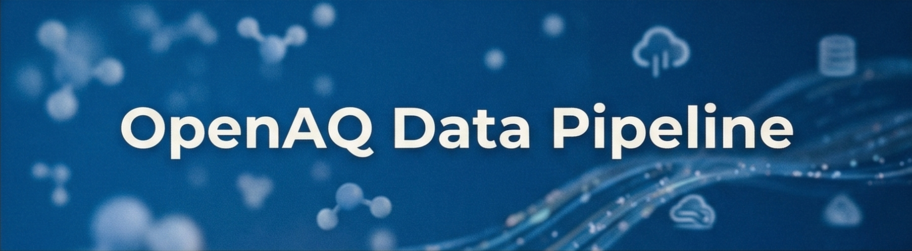
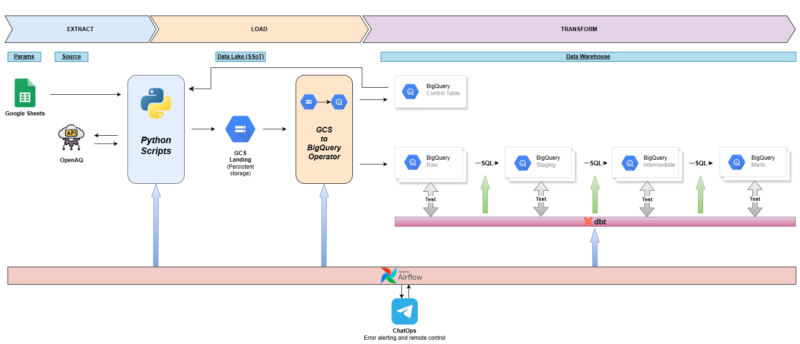
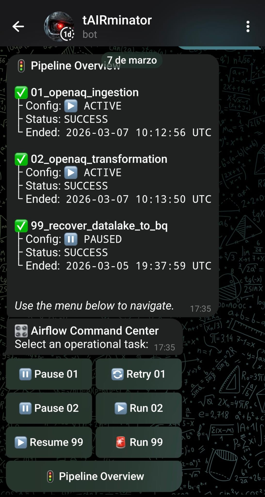
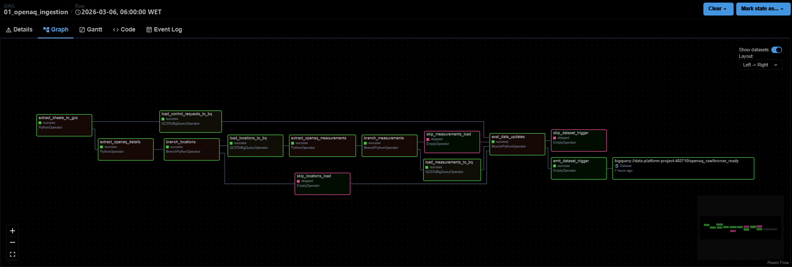
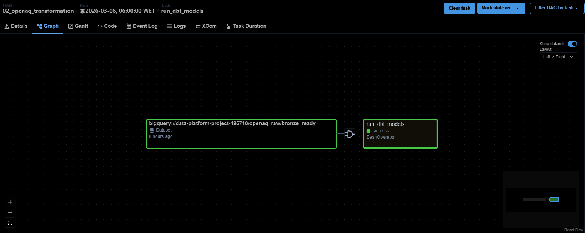
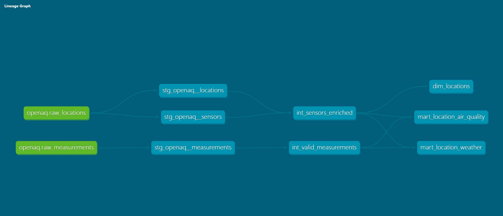

<p align="center">
  
</p>


# OpenAQ Data Pipeline: Global Air Quality ELT 

A modern, containerized, and scalable data pipeline designed to ingest, store, and transform real-time air quality data from the OpenAQ API into an analytics-ready Data Warehouse.


## 📑 Table of Contents

- [🔎 About](#-about)
- [🏗️ Architecture (Medallion Pattern & ChatOps)](#architecture)
- [✨ Engineering Highlights](#-engineering-highlights)
- [🧰 Tech Stack](#-tech-stack)
- [📸 Project Showcase](#-project-showcase)
- [📂 Project Structure](#-project-structure)
- [🚀 Quick Start](#-quick-start)

---

## 🔎 About
This repository houses a complete Data Platform that automates the ingestion of global air quality data. From raw API extraction to a highly optimized BigQuery Star Schema, the system is engineered for scale, emphasizing **idempotency, FinOps, strict data quality constraints, and advanced ChatOps observability**.

<a id="architecture"></a>
## 🏗️ Architecture (Medallion Pattern & ChatOps)

This pipeline implements a decoupled **ELT (Extract, Load, Transform)** architecture following the Medallion Data Design principles, augmented with a robust **ChatOps** layer for real-time monitoring and control.

<p align="center">
  
</p>


## ✨ Engineering Highlights

-  🤖 **Site Reliability Engineering (ChatOps):** Implemented **tAIRminator**, a custom containerized Telegram bot acting as a mobile Internal Developer Platform. Integrated bi-directionally with the Airflow REST API, it grants **Telegram ID-whitelisted users full operational control** over the infrastructure. Capabilities include receiving real-time failure alerts, monitoring live pipeline status, manually triggering runs, managing DAG states (pause/unpause), and executing on-demand Disaster Recovery protocols directly from a mobile interface.
    
- 🚨  **Disaster Recovery Strategy:** Designed an isolated, on-demand recovery DAG (`99_recover_datalake_to_bq`) that bypasses standard scheduling to perform full historical reloads from the Data Lake to BigQuery in case of Bronze layer corruption.
    
-  🚦 **Concurrency & Resource Control:** Enforced strict execution boundaries (`max_active_runs=1`) to prevent API rate-limiting during extraction and avoid database locks or data duplication during dbt transformation backfills.
    
-  🧠 **Data-Aware Orchestration:** Replaced rigid time-based triggers with Airflow Datasets (`schedule=[bronze_ready_dataset]`). The dbt transformation DAG automatically executes only when upstream data extraction is confirmed, decoupling dependencies.
    
- 🌟  **Dimensional Modeling (Star Schema):** Transformed raw API JSONs into a robust Star Schema consisting of a Conformed Dimension (`dim_locations`) and ultra-fast Fact tables (`mart_location_air_quality`, `mart_location_weather`).
    
-  🛡️ **Advanced Data Quality (DataOps):** Implemented custom generic Jinja macros in dbt to enforce physical laws on data (e.g., rejecting negative atmospheric particle concentrations or out-of-bounds thermodynamic temperatures) ensuring high-fidelity analytics.
    
-  🔄 **Idempotency & Surrogate Keys:** The pipeline is fully replayable. It utilizes deterministic MD5 hashing for Surrogate Keys and logical date partitioning to guarantee safe backfills without data duplication.
    
-  💰 **FinOps & BigQuery Optimization:** Designed with a composite physical layout combining partitioning by logical date (for cost-effective backfills) and clustering by geographical attributes to minimize bytes processed during BI queries.
    
- 🧬  **Schema Evolution Resilience:** Leverages BigQuery's native `JSON` data type for the Bronze layer ingestion, creating a defense against upstream API schema drift without breaking the ingestion DAGs.
    

## 🧰 Tech Stack

- ⏱️  **Orchestration:** Apache Airflow 2.9 (Dockerized).
    
- 🪄  **Transformation:** dbt core.
    
- 🏢  **Data Warehouse:** Google BigQuery.
    
-  🌊 **Data Lake:** Google Cloud Storage (Hive-partitioned NDJSON).
    
-  🐍 **Ingestion & Operations:** Python (Requests, Pandas, python-telegram-bot).
    
-  🐙 **Version Control:** Git & GitHub.
    
## 📸 Project Showcase

<details>
  <summary><b>🤖 ChatOps & Real-time Alerting (Telegram)</b></summary>
  <br>
  <blockquote>
    <b>Meet tAIRminator:</b> A custom mobile Command Center. It provides Telegram ID-whitelisted users with full remote operational control, instantly reacting to infrastructure events without leaving the chat.
  </blockquote>
  <p align="center">
    
    <br><br>
    <i>Dynamic UI with live pipeline overview and state-aware locking mechanism.</i>
    <br><br>
    
  </p>
</details>

<details>
  <summary><b>⚙️ Data-Aware Orchestration (Airflow)</b></summary>
  <br>
  <blockquote>
    Robust scheduling designed for strict idempotency. The system leverages Airflow's Data-Aware scheduling (Datasets) to trigger downstream transformations the exact moment ingestion succeeds.
  </blockquote>
  <p align="center">
    <b>DAG 01: API Ingestion (T-1 Window Processing)</b><br>
    
    <br><br>
    <b>DAG 02: dbt Transformation (Triggered by Datasets)</b><br>
    
  </p>
</details>

<details>
  <summary><b>🔀 Dimensional Modeling & Testing (dbt)</b></summary>
  <br>
  <blockquote>
    A modular Medallion architecture enforcing data quality. Automated tests (nullity, referential integrity, anomalies, freshness) run at every layer to ensure only validated data reaches the Business Intelligence marts.
  </blockquote>
  <p align="center">
    <i>End-to-end data lineage graph showing the progression from Raw to Marts.</i><br><br>
    
  </p>
</details>

## 📂 Project Structure


```
.
├── dags/                   # Airflow DAGs (Ingestion, Transform, Recovery)
├── scripts/                # Extraction Logic & ChatOps Bot Backend
├── openaq_transform/       # dbt Project (Models, Macros, Tests)
├── docker-compose.yaml     # Local Infrastructure Definition (Airflow + Bot)
├── Dockerfile.bot          # Custom image for the ChatOps service
└── README.md               # Documentation

```

## 🚀 Quick Start

**1.💻 Clone the repository:**


```
git clone [https://github.com/pacomoraless2/openaq-data-pipeline.git](https://github.com/pacomoraless2/openaq-data-pipeline.git)
cd openaq-data-pipeline

```

**2.🔑 Configure Credentials:**

-   Place your GCP Service Account JSON key at `config/google_credentials.json`.
    
-   Set up your required environment variables in the `.env` file (see `.env.example`). _Note: Telegram Bot tokens and allowed User IDs must be configured here for the ChatOps features to function._
    

**3.🐳 Launch Infrastructure:**


```
docker-compose up -d --build

```

**4.🌐 Access Interfaces:**

-   **Airflow UI:** `http://localhost:8080` (`airflow` / `airflow`)
    
-   **ChatOps:** Open your configured Telegram bot and send `/start` to access the command center.
    

----------
**_Developed by Paco Morales_**

[](https://www.linkedin.com/in/francisco-morales-pardo/)